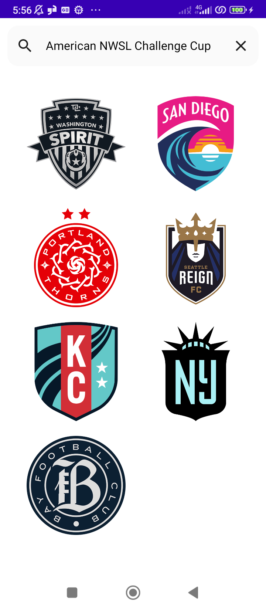

# TechnicalTest
the application allows you to display the list of teams by league 

Architecture
---------------
When start developpment an Android app it's very important to plan the architecture of the project becuse it will allow us to create complex, robust, good quality, easy to maintain applications so for this project i choose implemented MVVM + Clean Architecture becuase it's very recomanded.

Structure
---------------
data: (Model). Where we perform data operations(local and remote data).

domain: The domain layer is an optional layer that sits between the UI layer and the data layer.It contains the usecases. 

di: Dependency Injection with the help of Hilt.

ui: Jetpack compose View and ViewModels helping to display data to the user.

models: Our Models on the App

applications : contain the application Class

Screenshots
-----------

Application features
---------------
* get Leagues
* get Teams by league

Libraries Used
---------------
* [Kotlin](https://kotlinlang.org/) -language
* [Jetpack Compose](https://developer.android.com/develop/ui/compose) - view
* [ViewModel](https://developer.android.com/topic/libraries/architecture/viewmodel) - store and manage UI-related data in a lifecycle conscious way
* [LiveData](https://developer.android.com/jetpack/arch/livedata) - notify the view when data changes .
* [Lifecycle](https://developer.android.com/topic/libraries/architecture/lifecycle) - perform action when lifecycle state changes
* [Room](https://developer.android.com/topic/libraries/architecture/room) - SQLite database with in-app objects and compile-time checks
* [Material](https://material.io/develop/android/docs/getting-started/) - Material Components.
* [Coroutines](https://kotlinlang.org/docs/reference/coroutines-overview.html) and [Flow](https://developer.android.com/kotlin/flow) for async operations
* [Retrofit2](https://square.github.io/retrofit/)- networking
* [Coile](https://coil-kt.github.io/coil/compose/)- display images using coil
* [Dagger Hilt](https://dagger.dev/hilt/) - dependency injector
* [Gson](https://github.com/google/gson) - convert Java Objects into their JSON and vice versa
* [Mockito](https://site.mockito.org/) - mockito for mock data
* [Junit](https://junit.org/junit5/) - Junit for unit test

Api Used
---------------
(https://www.thesportsdb.com/api/v1/json/50130162/all_leagues.php) : API to retrieve the list of available leagues
(https://www.thesportsdb.com/api/v1/json/50130162/search_all_teams.php?l=French%20Ligue%201) : API to build the list of teams in a league
